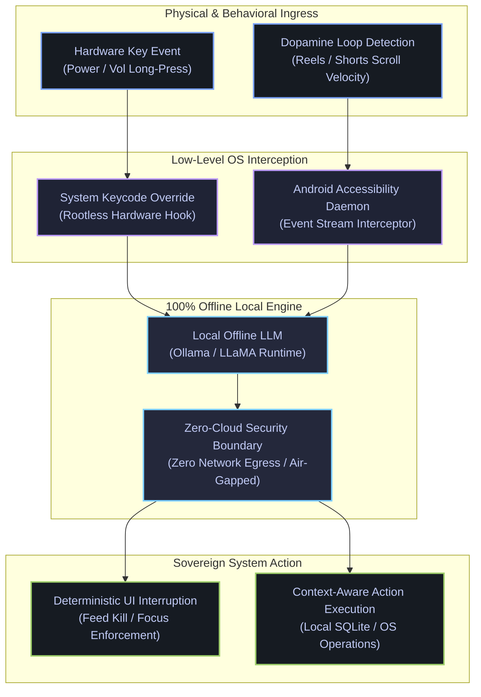

<!--
  =============================================================================
  TANJIM AHMMED SHUVO — GITHUB PROFILE README
  Target Repository: github.com/tanjim-ahmmed-shuvo/tanjim-ahmmed-shuvo
  =============================================================================
-->

  <picture>
    <source media="(prefers-color-scheme: dark)" srcset="https://readme-typing-svg.demolab.com?font=Fira+Code&weight=600&size=24&duration=3000&pause=1200&color=7AA2F7&center=true&vCenter=true&width=780&lines=Tanjim+Ahmmed+Shuvo+%E2%80%94+Software+Architect;Full-Stack+Systems+Builder+%26+Deep-Tech+Engineer;Founder+%40+Crolop+%7C+Founder+%26+CEO+%40+DigifixBD;Sovereign+AI+%26+Zero-Trust+Infrastructure+Specialist">
    <source media="(prefers-color-scheme: light)" srcset="https://readme-typing-svg.demolab.com?font=Fira+Code&weight=600&size=24&duration=3000&pause=1200&color=3B82F6&center=true&vCenter=true&width=780&lines=Tanjim+Ahmmed+Shuvo+%E2%80%94+Software+Architect;Full-Stack+Systems+Builder+%26+Deep-Tech+Engineer;Founder+%40+Crolop+%7C+Founder+%26+CEO+%40+DigifixBD;Sovereign+AI+%26+Zero-Trust+Infrastructure+Specialist">
    
  </picture>

  <strong>Decoupling business growth from manual labor via high-performance web applications, autonomous automation pipelines, zero-trust cloud infrastructure, and sovereign on-device AI.</strong>

  
  
  
  
  

---

### 👨‍💻 About Tanjim Ahmmed Shuvo

I am a **Software Architect & Systems Builder** based in Bangladesh, working globally. I architect and engineer custom commercial software platforms, real-time operating systems for brick-and-mortar retail/restaurants, self-healing automation clusters, enterprise digital goods platforms, and privacy-preserving local AI solutions.

- 🏢 **Founder** at **Crolop** & **DigifixBD** (serving 1,000+ client systems and businesses).
- ⚙️ **Core Philosophy**: Replace manual operational friction with deterministic software, hardened security perimeters, and real-time data sync.
- 🎯 **Primary Focus Areas**:
  - Full-Stack Web & Real-Time Client Systems (React, Next.js, TypeScript, WebSockets)
  - Distributed Backend & Event Pipelines (Node.js, Python, n8n, Meta WhatsApp API)
  - High-Integrity Datastores & Ledgers (PostgreSQL, Supabase, SQLite, Row-Level Security)
  - Cloud Defense & Zero-Trust Architecture (Cloudflare Tunnels, mTLS, OWASP Defense, Burp Suite Audits)
  - Sovereign On-Premise AI & Low-Level Hardware (Ollama, Local LLaMA, Raspberry Pi, Custom Linux Kernels)

---

## 🛠️ Technology Arsenal & Skills Showcase

### 01. Frontend & Reactive Client Systems

  

  
  
  
  
  
  
  

| Technology | Architectural Specialty | Impact & Context |
| :--- | :--- | :--- |
| **React** | Component lifecycle & state machines | Declarative UI, resilient reactive state across live interfaces |
| **Next.js** | Server Components & Edge SSR | SEO-optimized rendering, lightning-fast edge performance |
| **TypeScript** | Strict type contracts & schemas | Compile-time safety, zero-regression interface boundaries |
| **JavaScript (ES6+)** | Event loop, V8 engine internals & async | High-concurrency browser performance and DOM optimization |
| **Tailwind CSS** | Design tokens & responsive design systems | Micro-interactions, fluid layouts, cohesive aesthetic systems |
| **WebSockets** | Bi-directional socket connections | **< 50ms** real-time sync across multi-terminal dashboards |

---

### 02. Backend Runtimes, Event Pipelines & Automation

  

  
  
  
  
  
  

| Technology | Architectural Specialty | Impact & Context |
| :--- | :--- | :--- |
| **Node.js** | Non-blocking async event loop | High-throughput API gateways and background daemon workers |
| **Python** | Automation scripting & data glue | Data transformations, headless scrapers, and pipeline glue |
| **C / C++** | Low-level memory & system calls | Hardware communication, daemon execution, kernel-level hooks |
| **Linux Bash** | Server automation & cron orchestration | Automated server provisioning, health audits, failover scripts |
| **n8n** | Distributed self-hosted workflow engine | Complex multi-step webhooks, alerting pipelines & data sync |
| **WhatsApp API** | Meta Cloud API integration | Automated invoice dispatch, license keys & reminder alerts |

---

### 03. Datastores, Caching & Financial Ledgers

  

  
  
  
  
  

| Datastore | Architectural Specialty | Impact & Context |
| :--- | :--- | :--- |
| **PostgreSQL** | ACID transactions & row-level locking | Pessimistic concurrency control for financial double-entry |
| **MySQL** | Relational schemas & optimized indexing | High-volume read/write workloads and legacy system migration |
| **Supabase** | Row-Level Security (RLS) & Realtime CDC | Fine-grained data access policies, Postgres triggers, Edge Functions |
| **SQLite** | Embedded zero-network datastore | High-speed local write-ahead log (WAL) for offline-first clients |
| **IndexedDB** | In-browser persistent offline ledger | Client-side caching and offline queueing with auto-sync |

---

### 04. AppSec, Zero-Trust & Cloud Infrastructure

  

  
  
  
  
  
  

| Tool / Platform | Architectural Specialty | Impact & Context |
| :--- | :--- | :--- |
| **Cloudflare** | Zero-Trust Tunnels & Edge Workers | **Zero exposed origin ports**, edge caching, DDoS absorption |
| **Docker** | Microservice container isolation | Reproducible environments, lightweight runtime sandboxes |
| **Burp Suite Pro** | Web application penetration testing | Manual SQLi, logic flaw audits, perimeter vulnerability assessment |
| **Wireshark** | Deep packet inspection & forensics | Protocol verification, MITM analysis, TLS 1.3 verification |
| **OWASP Top 10** | Defensive parameter & token hardening | CSRF, SSRF, XSS, and Broken Object Level Authorization protection |
| **Git & GitHub** | Distributed version control & CI/CD | Branch protection, automated build pipelines, semantic release |

---

### 05. Low-Level Systems, Hardware & Sovereign AI

  

  
  
  
  
  
  

| Technology | Architectural Specialty | Impact & Context |
| :--- | :--- | :--- |
| **Ollama & Local LLMs** | Sovereign on-device intelligence | Air-gapped LLaMA runtimes, **zero cloud API fees**, zero data egress |
| **Raspberry Pi** | Edge micro-servers & relays | ARM single-board computers for localized hub and gateway duties |
| **Arduino** | Microcontroller sensor circuits | Hardware relays, GPIO triggers, and physical event sensors |
| **Android ADB / Fastboot** | Deep mobile diagnostics & recovery | Bootloader unbricking, partition flashing, low-level OS analysis |
| **Custom Firmware** | Custom ROM & kernel provisioning | Removing bloatware, system-level security hardening |
| **Arch / Kali / Ubuntu** | Advanced Linux kernel environments | Custom daemons, penetration testing environments, server hardening |

---

## 🚀 Featured Flagship Systems & Production Architectures

### 1. 🍽️ Real-Time Restaurant POS, Inventory & Customer Web Platform
- **Problem**: In-restaurant dining rushes, kitchen ticket backlogs, cash registers, and multi-branch inventories frequently desynchronize, causing missed orders and accounting discrepancies.
- **Solution**: Engineered a full commercial web and local network ecosystem uniting customer web ordering, gamified loyalty points, multi-terminal POS with **< 50ms WebSocket synchronization**, live Kitchen Display Systems (KDS), and cash drawer audits.
- **Stack**: `React`, `TypeScript`, `Node.js`, `WebSockets`, `PostgreSQL`, `Cloudflare Pages & Edge`.

### 2. ⚡ Automated Digital Agency & SMM Panel SaaS Platform
- **Problem**: Digital agencies selling software licenses, digital services, and marketing panels suffer from manual delivery bottlenecks, stockout errors, checkout abandonment, and DDoS attacks on exposed databases.
- **Solution**: Built an automated SaaS platform featuring instant digital download delivery, back-order license key assignment, multi-provider SMM API sync with automatic margin calculation, 3-day automated WhatsApp/SMS renewal reminders, and a reverse-proxied Supabase backend with Cloudflare R2 storage.
- **Stack**: `Supabase (PostgreSQL)`, `Cloudflare R2 & Tunnels`, `Meta WhatsApp API`, `TypeScript`, `Tailwind CSS`.

### 3. 🛡️ Zero-Trust Cloud Hosting, Edge Tunneling & AppSec
- **Problem**: Publicly exposing web application origin IPs and server ports leads to bot scanning, credential stuffing, and brute-force DDoS downtime.
- **Solution**: Deployed encrypted Cloudflare Zero-Trust Tunnels that completely hide origin IP addresses and shut down public ports. Verified defense boundaries using Burp Suite Pro, TLS 1.3 hardening, and adaptive rate limiting.
- **Impact**: **100% cloaked origin ports** across enterprise client deployments.

### 4. 🧠 Sovereign On-Device Local AI Runtime
- **Problem**: Cloud AI APIs incur perpetual per-token fees, latency overheads, and severe data privacy compliance risks for proprietary business intelligence.
- **Solution**: Engineered an offline-first execution environment leveraging Ollama and quantized LLaMA models running directly on localized hardware. Delivers real-time summarization, intent detection, and automated workflows with **zero external egress**.

---

## 📐 Architecture Spotlight: Sovereign AI Execution Flow

---

## 📊 GitHub Telemetry & Activity Metrics

  <picture>
    <source media="(prefers-color-scheme: dark)" srcset="https://github-stats-extended.vercel.app/api?username=tanjim-ahmmed-shuvo&theme=tokyonight&hide_border=true&count_private=true&show_icons=true&title_color=7AA2F7&icon_color=7AA2F7&text_color=A9B1D6&bg_color=161B22">
    <source media="(prefers-color-scheme: light)" srcset="https://github-stats-extended.vercel.app/api?username=tanjim-ahmmed-shuvo&theme=tokyonight_light&hide_border=true&count_private=true&show_icons=true&title_color=3B82F6&icon_color=3B82F6&text_color=343B58&bg_color=F7F7F7">
    
  </picture>
  <picture>
    <source media="(prefers-color-scheme: dark)" srcset="https://github-stats-extended.vercel.app/api/top-langs/?username=tanjim-ahmmed-shuvo&theme=tokyonight&hide_border=true&layout=compact&title_color=7AA2F7&text_color=A9B1D6&bg_color=161B22">
    <source media="(prefers-color-scheme: light)" srcset="https://github-stats-extended.vercel.app/api/top-langs/?username=tanjim-ahmmed-shuvo&theme=tokyonight_light&hide_border=true&layout=compact&title_color=3B82F6&text_color=343B58&bg_color=F7F7F7">
    
  </picture>

  <picture>
    <source media="(prefers-color-scheme: dark)" srcset="https://streak-stats.demolab.com/?user=tanjim-ahmmed-shuvo&theme=tokyonight&hide_border=true&ring=7AA2F7&fire=7AA2F7&currStreakLabel=7AA2F7&sideNums=A9B1D6&sideLabels=A9B1D6&dates=A9B1D6&background=161B22">
    <source media="(prefers-color-scheme: light)" srcset="https://streak-stats.demolab.com/?user=tanjim-ahmmed-shuvo&theme=tokyonight_light&hide_border=true&ring=3B82F6&fire=3B82F6&currStreakLabel=3B82F6&sideNums=343B58&sideLabels=343B58&dates=343B58&background=F7F7F7">
    
  </picture>

---

## 🤝 Initiate Collaboration & Technical Inquiries

Interested in building high-scale web platforms, custom POS software, automated business pipelines, or hardening your cloud security? Let's connect:

  
  
  

  Designed &amp; Engineered by <strong>Tanjim Ahmmed Shuvo</strong> &bull; Crafted for high-performance GitHub Profiles

