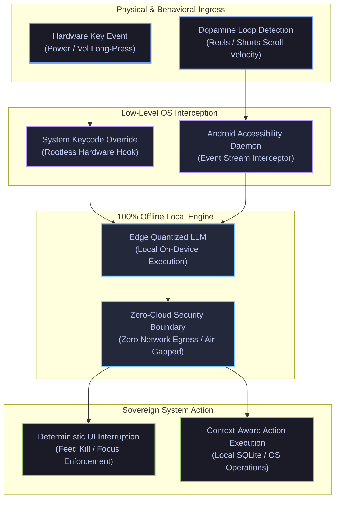

<p align="center">
  <picture>
    <source media="(prefers-color-scheme: dark)" srcset="https://readme-typing-svg.demolab.com?font=Fira+Code&weight=600&size=24&duration=3000&pause=1200&color=7AA2F7&center=true&vCenter=true&width=750&lines=Systems+Architect+%7C+Deep-Tech+Builder;Founder+%26+CEO+%40+DigifixBD;Venture+Lead+%40+COROLAB;Sovereign+AI+%26+Zero-Trust+Security+Engineer">
    <source media="(prefers-color-scheme: light)" srcset="https://readme-typing-svg.demolab.com?font=Fira+Code&weight=600&size=24&duration=3000&pause=1200&color=3B82F6&center=true&vCenter=true&width=750&lines=Systems+Architect+%7C+Deep-Tech+Builder;Founder+%26+CEO+%40+DigifixBD;Venture+Lead+%40+COROLAB;Sovereign+AI+%26+Zero-Trust+Security+Engineer">
    
  </picture>
</p>

<p align="center">
  <strong>Decoupling business growth from manual labor via autonomous systems, low-level OS control, zero-trust infrastructure, and sovereign on-device AI.</strong>
</p>

<p align="center">
  <a href="https://tanjim.dev">
    
  </a>
  <a href="https://digifixbd.com">
    
  </a>
  <a href="mailto:tanjim@digifixbd.com">
    
  </a>
</p>

---

### // 01. Enterprise Ecosystem Architecture

| Dimension | COROLAB (Global Flagship Venture) | DigifixBD (Operating Infrastructure) |
| :--- | :--- | :--- |
| **Role & Mandate** | Deep-Tech R&D & Sovereign Innovation Lab | Founder & CEO / Operational Backbone |
| **Core Focus** | Edge Compute, Sovereign Local AI & Autonomous Systems | Enterprise Modernization, Defense & Cloud Infrastructure |
| **Execution Domain** | Offline LLM runtimes, OS-level hooks, zero-cloud agents | Scaled digital infrastructure & autonomous workflow automation |
| **Impact Metric** | Autonomous IP generation & next-gen deep tech | 1,000+ client systems deployed, hardened, and maintained |

---

### // 02. Systems Architecture & Technical Matrix

<details>
<summary><b>Expand Full System Architecture & Technical Matrix</b></summary>

```text
===================================================================================================
                               SYSTEM ARCHITECTURE & CAPABILITY HIERARCHY
===================================================================================================
[ LAYER 01 : APPLICATION SECURITY & NETWORK FORENSICS ]
  ├── Web Application Pentesting : Burp Suite Pro, Manual SQLi, Logic Bypass Audits
  ├── Network Inspection        : Wireshark Deep Packet Forensics, MITM Defense, TLS 1.3 Hardening
  └── Perimeter Defense         : HTTP 429 Adaptive Rate Limiting, OWASP Top 10 Active Mitigation

[ LAYER 02 : LOW-LEVEL OS INTERNALS & CROSS-PLATFORM CONTROL ]
  ├── Kernel & Distros          : Arch Linux, Kali Linux, Parrot OS, Ubuntu LTS, Custom Linux Daemons
  ├── Android Low-Level Runtime : Bootloader Unlock, Bootloop Debug, Zygisk/Magisk Root, Vendor Partitions
  └── Hardware Platform Control : macOS, iOS, Windows, Android System Architectures, Non-Standard Dual-Boot

[ LAYER 03 : COMPUTER ARCHITECTURE & HARDWARE RUNTIME ]
  ├── Execution Pipeline        : BIOS/UEFI POST Sequence Analysis, Low-Level Firmware Hooks
  ├── Bus Hierarchy             : RAM / ROM Data Bus Timing, Bus Interconnect Constraints
  └── Compute Engines           : GPU Parallel Mechanics, CUDA Kernels, Local LLM Quantization

[ LAYER 04 : ZERO-TRUST CLOUD & DISTRIBUTED INFRASTRUCTURE ]
  ├── Cloudflare Fabric         : Zero-Trust Tunnels (No Exposed IP/Ports), Edge Workers, R2 Buckets
  ├── Ingress & Routing         : Reverse Proxy Optimization, Edge Caching, Dynamic Load Termination
  └── Runtime Orchestration     : Microservices Decoupling, WebSockets, Linux systemd Watchdogs

[ LAYER 05 : EMBEDDED SYSTEMS & HARDWARE AUTOMATION ]
  ├── Silicon Targets           : ESP32, ESP8266, ARM Cortex (Raspberry Pi), ATmega (Arduino)
  └── Physical Automation       : High-Voltage Relay Systems, Sensor Mesh, Edge-to-Cloud Relays

[ LAYER 06 : AUTONOMOUS ENTERPRISE & COMMUNICATION SYSTEMS ]
  ├── Core Stack                : TypeScript, React, Node.js, Supabase (PostgreSQL), Tailwind CSS
  ├── Workflow Orchestration    : Self-Hosted n8n Clusters, Event-Driven Webhooks, Distributed Workers
  ├── Notification Automation   : WhatsApp Business API, Transactional SMS Gateways, Automated Customer Reminders
  └── Enterprise Architectures  : Multi-Role Real-Time Portals (e.g. One Sixty Five By One 5-Panel OS)
===================================================================================================
```

</details>

<p align="center">
  <picture>
    <source media="(prefers-color-scheme: dark)" srcset="https://skillicons.dev/icons?i=ts,react,nodejs,tailwind,postgres,supabase,cloudflare,docker,linux,bash,arduino,raspberrypi&theme=dark">
    <source media="(prefers-color-scheme: light)" srcset="https://skillicons.dev/icons?i=ts,react,nodejs,tailwind,postgres,supabase,cloudflare,docker,linux,bash,arduino,raspberrypi&theme=light">
    
  </picture>
</p>

---

### // 03. Flagship R&D: Sovereign On-Device AI Assistant

An offline-first, private AI execution runtime built directly on Android internals to dismantle digital friction and enforce user autonomy without external network egress.



---

### // 04. Production Implementations

| System / Platform | Architecture Highlights | Scale / Impact |
| :--- | :--- | :--- |
| **DigifixBD Operating Core** | Zero-Trust enterprise portal, Cloudflare Tunnel ingress, distributed webhook automations, automated client SLA pipeline. | Operational backbone powering digital defense and automation for **1,000+ businesses**. |
| **Enterprise Notification Engine** | WhatsApp Business API & transactional SMS gateway pipelines, event-driven webhooks, automated customer reminder systems. | High-deliverability notification infra eliminating manual follow-up labor for client ecosystems. |
| **One Sixty Five By One** | Multi-role restaurant operating system, real-time WebSockets synchronization, 5 dedicated live-role dashboards with zero cross-talk. | Reduced order latency to **< 50ms** across Kitchen, Service, POS, Cashier, and Executive management. |
| **Financial Ledger & Wallet Core** | Event-sourced transaction log, cryptographically audited state transitions, strict PostgreSQL isolation, defense-in-depth API boundaries. | Zero data anomaly threshold across high-volume reconciliation cycles and balance states. |
| **Sovereign AI Engine (COROLAB)** | Background Android event hooks, native hardware key interception, zero-cloud local LLM runtime, active dopamine loop interdiction. | **100% sovereign data privacy**; eliminates edge latency and eradicates infinite-scroll loops. |

---

### // 05. Real-Time Telemetry & Systems Activity

<p align="center">
  <picture>
    <source media="(prefers-color-scheme: dark)" srcset="https://github-readme-stats.vercel.app/api?username=tanjim-ahmmed-shuvo&theme=tokyonight&hide_border=true&count_private=true&show_icons=true&title_color=7AA2F7&icon_color=7AA2F7&text_color=A9B1D6&bg_color=1A1B26">
    <source media="(prefers-color-scheme: light)" srcset="https://github-readme-stats.vercel.app/api?username=tanjim-ahmmed-shuvo&theme=tokyonight_light&hide_border=true&count_private=true&show_icons=true&title_color=3B82F6&icon_color=3B82F6&text_color=343B58&bg_color=F7F7F7">
    
  </picture>
  <picture>
    <source media="(prefers-color-scheme: dark)" srcset="https://github-readme-stats.vercel.app/api/top-langs/?username=tanjim-ahmmed-shuvo&theme=tokyonight&hide_border=true&layout=compact&title_color=7AA2F7&text_color=A9B1D6&bg_color=1A1B26">
    <source media="(prefers-color-scheme: light)" srcset="https://github-readme-stats.vercel.app/api/top-langs/?username=tanjim-ahmmed-shuvo&theme=tokyonight_light&hide_border=true&layout=compact&title_color=3B82F6&text_color=343B58&bg_color=F7F7F7">
    
  </picture>
</p>

<p align="center">
  <picture>
    <source media="(prefers-color-scheme: dark)" srcset="https://github-readme-streak-stats.herokuapp.com/?user=tanjim-ahmmed-shuvo&theme=tokyonight&hide_border=true&ring=7AA2F7&fire=7AA2F7&currStreakLabel=7AA2F7&sideNums=A9B1D6&sideLabels=A9B1D6&dates=A9B1D6&background=1A1B26">
    <source media="(prefers-color-scheme: light)" srcset="https://github-readme-streak-stats.herokuapp.com/?user=tanjim-ahmmed-shuvo&theme=tokyonight_light&hide_border=true&ring=3B82F6&fire=3B82F6&currStreakLabel=3B82F6&sideNums=343B58&sideLabels=343B58&dates=343B58&background=F7F7F7">
    
  </picture>
</p>

---

### // 06. Executive Directive

> *"Resilient infrastructure is not an afterthought; it is the fundamental physics of the digital world. We engineer autonomous systems so human capital can shift from repetitive maintenance to unconstrained frontier exploration."*

<p align="center">
  <a href="mailto:tanjim@digifixbd.com">
    
  </a>
</p>
